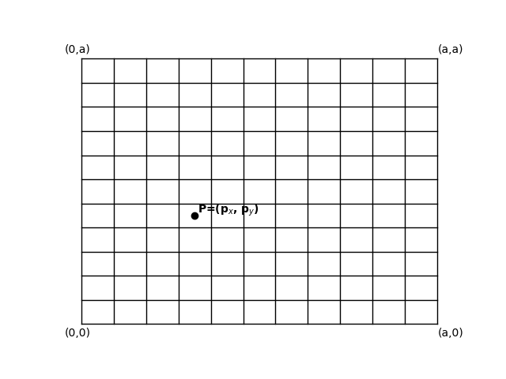

# Getting Started with Betafold

**betafold** is a physics engine designed to simulate the behavior of a particle using data learned and output determined by processing via a transformer deep learning architecture.

## Energy of Particles in Space

With **betafold**, users can simulate the behavior of particles based on some initial state within some predefined 3D space. The behavior of a particle is defined by its Hamiltonian in a particular increment of space. 

### Particles in Space

Let the space be defined as $$P$$ which is bound by $$a$$ such that

$$
P \subseteq \mathbb R^n
$$

A particle *p* in a 2-dimensional space $$P$$ in Betafold as seen in Figure 1 can be defined as 

$$
p \in P
$$
$$
\|p_x\|, \|p_y\|  < a
$$
$$
a \in \mathbb R
$$

*Figure 1*

### The Hamiltonian of a Particle in Betafold

The Hamiltonian of a particle is defined as 

$$
\hat H = \hat T + \hat V,
$$

where $$\hat T$$ is its kinetic energy and $$\hat V$$ is its potential energy.
\
\
In this case we let $$\hat V = 0$$, so

$$\hat H = \frac {1}{2}m\vec v^2$$

A particle's initial state is captured in the input vector $$I$$ which is defined as

$$
I = (p, \hat H),
$$

where

$$
p \in P
$$ and 
$$
\hat H = \frac {1}{2}m\vec v_p^2
$$
